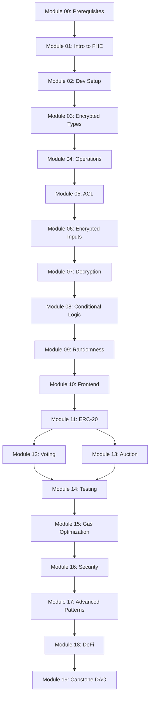

# Curriculum overview

The FHEVM Bootcamp is a comprehensive, hands-on training program consisting of **20 modules** organized into a 4-week progressive curriculum. Each module includes lecture content, code examples, hands-on exercises, and assessments.

## Program structure

**Total duration:** ~63 hours (~16 hours/week over 4 weeks)

| Week | Theme | Modules | Hours | Milestone |
|------|-------|---------|-------|----------|
| **Week 1** | Foundation & operations | 00-04 | ~12h | Encrypted Calculator homework |
| **Week 2** | Core patterns | 05-09 | ~14h | Encrypted Vault homework |
| **Week 3** | Applications & testing | 10-14 | ~18h | Token + Voting homework |
| **Week 4** | Mastery & capstone | 15-19 | ~19h | Capstone DAO project |

<Note>
Each week ends with a homework assignment with formal grading criteria.
</Note>

## Assessment system

The bootcamp uses a comprehensive assessment framework:

| Component | Weight | Description |
|-----------|--------|-------------|
| **Quizzes** | 20% | End-of-module knowledge checks (multiple choice + short answer) |
| **Exercises** | 40% | Hands-on coding graded on correctness (50%), code quality (25%), and security (25%) |
| **Capstone project** | 40% | Original FHE application with contracts, tests, documentation, and presentation |

### Passing requirements

- Overall score of **70% or higher**
- Minimum **60% in each component**
- Capstone must compile, deploy, and pass all provided test cases

### Grading scale

| Grade | Range |
|-------|-------|
| Distinction | 90-100% |
| Merit | 80-89% |
| Pass | 70-79% |
| Fail | Below 70% |

## Module breakdown

### Week 1: Foundation & operations

<AccordionGroup>
  <Accordion title="Module 00: Prerequisites & Solidity review (2 hours)">
    **Level:** Beginner

    **Description:** Foundational Solidity knowledge and development tooling basics. Covers types, functions, modifiers, mappings, events, and Hardhat setup.

    **Learning objectives:**
    - Write basic Solidity contracts using mappings, structs, modifiers, and events
    - Compile and deploy contracts using Hardhat
    - Explain why public blockchains leak information
    - Describe encryption types at a high level
    - Set up a working Node.js development environment

    **Topics:** Solidity review, Hardhat project structure, blockchain privacy motivation

    **Contract:** `SimpleStorage.sol`, `BasicToken.sol`
  </Accordion>

  <Accordion title="Module 01: Introduction to FHE (2 hours)">
    **Level:** Beginner

    **Description:** Cryptographic foundations of Fully Homomorphic Encryption. Build intuition for why FHE is transformative for blockchain privacy.

    **Learning objectives:**
    - Explain what "fully homomorphic" means
    - Identify core FHE schemes (BGV, BFV, CKKS, TFHE) and trade-offs
    - Articulate why FHE solves problems that ZK proofs and TEEs cannot
    - Describe the noise budget concept
    - Explain fhEVM architecture at a high level

    **Topics:** FHE history, TFHE scheme, noise management, FHE vs ZK vs TEE, fhEVM introduction
  </Accordion>

  <Accordion title="Module 02: Development setup (2 hours)">
    **Level:** Beginner

    **Description:** Complete fhEVM development environment setup. Deploy and interact with your first encrypted contract.

    **Learning objectives:**
    - Set up Hardhat with the fhEVM plugin
    - Diagram the fhEVM architecture (coprocessor, gateway, on-chain components)
    - Explain the role of the global FHE key and ACL system
    - Deploy and interact with an encrypted contract
    - Describe the lifecycle of an encrypted transaction

    **Topics:** fhEVM architecture, coprocessor model, key management, `ZamaEthereumConfig`, Relayer SDK

    **Contract:** `HelloFHEVM.sol`
  </Accordion>

  <Accordion title="Module 03: Encrypted types (3 hours)">
    **Level:** Beginner

    **Description:** Master all encrypted types from `ebool` to `euint256` and `eaddress`. Learn type fundamentals, casting, and storage patterns.

    **Learning objectives:**
    - List all encrypted types and their plaintext equivalents
    - Declare and initialize encrypted state variables
    - Cast between encrypted types using `FHE.asEuintXX()`
    - Explain overflow/wrapping behavior
    - Choose the appropriate encrypted type for use cases

    **Topics:** All encrypted types, type casting, wrapping behavior, storage patterns, gas implications

    **Contracts:** `EncryptedTypes.sol`, `TypeConversions.sol`
  </Accordion>

  <Accordion title="Module 04: Operations (arithmetic, bitwise, comparison) (3 hours)">
    **Level:** Intermediate

    **Description:** Master the full set of operations on encrypted types: arithmetic, bitwise, shift, comparison, and min/max.

    **Learning objectives:**
    - Perform arithmetic operations (`FHE.add`, `sub`, `mul`, `div`, `rem`)
    - Apply bitwise and shift operations
    - Use all comparison operators (return `ebool`)
    - Use `FHE.min`, `FHE.max`, and `FHE.neg`
    - Mix encrypted and plaintext operands

    **Topics:** Arithmetic, bitwise, shift, comparison operations, mixed operands, gas costs, operation chaining

    **Contracts:** `ArithmeticOps.sol`, `BitwiseOps.sol`, `ComparisonOps.sol`
  </Accordion>
</AccordionGroup>

**Week 1 homework:** Encrypted Calculator — build a contract performing all FHE operations with comprehensive tests.

### Week 2: Core patterns

<AccordionGroup>
  <Accordion title="Module 05: Access control / ACL (3 hours)">
    **Level:** Intermediate

    **Description:** The ACL system is fundamental to fhEVM security. Master the full ACL API and permission patterns.

    **Learning objectives:**
    - Explain why ACLs are necessary
    - Use `FHE.allow()` and `FHE.allowThis()` for persistent permissions
    - Use `FHE.allowTransient()` for temporary access
    - Design correct permission flows for multi-party interactions
    - Debug common ACL errors

    **Topics:** ACL purpose, persistent vs transient permissions, multi-contract ACL flows, permission patterns, debugging

    **Contracts:** `ACLDemo.sol`, `MultiUserVault.sol`
  </Accordion>

  <Accordion title="Module 06: Encrypted inputs & proofs (3 hours)">
    **Level:** Intermediate

    **Description:** Learn the full input pipeline from client-side encryption to contract processing using `externalEuintXX` types.

    **Learning objectives:**
    - Encrypt values client-side using Relayer SDK
    - Receive and convert inputs using `FHE.fromExternal(value, proof)`
    - Implement input validation for encrypted values
    - Handle multiple encrypted inputs
    - Explain security properties of input encryption

    **Topics:** Client-side encryption with Relayer SDK, `externalEuintXX` types, `FHE.fromExternal()`, ZKP proofs, input validation

    **Contract:** `SecureInput.sol`
  </Accordion>

  <Accordion title="Module 07: Decryption patterns (3 hours)">
    **Level:** Intermediate

    **Description:** Learn when and how to reveal encrypted results using `FHE.makePubliclyDecryptable()` and user-specific decryption.

    **Learning objectives:**
    - Use `FHE.makePubliclyDecryptable()` for on-chain reveal
    - Use ACL + `instance.userDecrypt()` for user-specific decryption
    - Understand the deprecated Gateway callback pattern (historical context)
    - Evaluate privacy implications of decryption strategies
    - Design contracts that minimize unnecessary decryption

    **Topics:** Public decryption, re-encryption for users, asynchronous decryption, privacy analysis, design patterns

    **Contracts:** `PublicDecrypt.sol`, `UserDecrypt.sol`
  </Accordion>

  <Accordion title="Module 08: Conditional logic / FHE.select (3 hours)">
    **Level:** Intermediate

    **Description:** Master branchless conditional logic using `FHE.select()` as an encrypted ternary operator.

    **Learning objectives:**
    - Use `FHE.select(ebool, valueIfTrue, valueIfFalse)` for conditionals
    - Combine encrypted booleans with `FHE.and`, `or`, `xor`, `not`
    - Refactor branching logic into branchless patterns
    - Implement multi-condition encrypted logic chains
    - Apply the "compute both paths, select the result" pattern

    **Topics:** Why `if` doesn't work on encrypted values, `FHE.select` pattern, boolean logic, nested selects, refactoring guide

    **Contracts:** `ConditionalDemo.sol`, `EncryptedMinMax.sol`
  </Accordion>

  <Accordion title="Module 09: On-chain randomness (2 hours)">
    **Level:** Intermediate

    **Description:** fhEVM provides built-in encrypted random number generation. Learn security properties and use cases.

    **Learning objectives:**
    - Generate encrypted random numbers using `FHE.randEuintXX()`
    - Explain security properties (unpredictability, privacy)
    - Use encrypted randomness in gaming, lotteries, random selection
    - Apply range reduction techniques
    - Identify common pitfalls

    **Topics:** `FHE.randEuintXX()`, `FHE.randEbool()`, security model, range reduction, use cases, best practices

    **Contracts:** `RandomDemo.sol`, `EncryptedLottery.sol`
  </Accordion>
</AccordionGroup>

**Week 2 homework:** Encrypted Vault with Access Control — deposit/withdraw with limits, ACL sharing, and randomness.

### Week 3: Applications & testing

<AccordionGroup>
  <Accordion title="Module 10: Frontend integration (3 hours)">
    **Level:** Intermediate

    **Description:** Bridge smart contracts and user-facing applications using the Relayer SDK, ethers.js/viem, and React.

    **Learning objectives:**
    - Initialize the Relayer SDK and connect to fhEVM network
    - Encrypt user inputs and submit as `externalEuintXX` parameters
    - Request and process re-encrypted outputs
    - Build a complete React frontend
    - Handle wallet connection and encrypted state display

    **Topics:** Relayer SDK API, client-side encryption, re-decryption, React integration, ethers.js/viem, UX patterns

    **Contract:** `SimpleCounter.sol`
  </Accordion>

  <Accordion title="Module 11: Confidential ERC-20 (4 hours)">
    **Level:** Advanced

    **Description:** Build a complete ERC-20 token where all balances and transfer amounts are encrypted.

    **Learning objectives:**
    - Implement encrypted ERC-20 with confidential balances
    - Handle "sufficient balance" check using `FHE.ge()` and `FHE.select`
    - Manage ACL permissions across transfers and approvals
    - Implement encrypted `approve` and `transferFrom`
    - Add selective balance viewing via ACL + client-side decryption

    **Topics:** Encrypted ERC-20 design, receiving inputs via `externalEuint64`, encrypted transfers, silent fail pattern, approvals, ACL management

    **Contract:** `ConfidentialERC20.sol`
  </Accordion>

  <Accordion title="Module 12: Confidential voting (4 hours)">
    **Level:** Advanced

    **Description:** Build a voting system where votes are encrypted, tallied homomorphically, and only the final result is decrypted.

    **Learning objectives:**
    - Design a confidential voting protocol
    - Implement encrypted vote submission via `externalEuint32`
    - Perform homomorphic tallying using `FHE.add`
    - Handle tally reveal using Gateway decryption
    - Prevent common voting attacks

    **Topics:** Voting system requirements, encrypted ballot submission, homomorphic tallying, voter eligibility, double-vote prevention, tally reveal

    **Contracts:** `ConfidentialVoting.sol`, `PrivateVoting.sol`
  </Accordion>

  <Accordion title="Module 13: Sealed-bid auction (4 hours)">
    **Level:** Advanced

    **Description:** Implement first-price and second-price (Vickrey) auctions with encrypted bids and homomorphic winner determination.

    **Learning objectives:**
    - Design a sealed-bid auction protocol
    - Implement encrypted bid submission via `externalEuint64`
    - Perform encrypted bid comparison using `FHE.gt` and `FHE.select`
    - Implement first-price and Vickrey auction variants
    - Analyze security properties and limitations

    **Topics:** Auction types, encrypted bid storage, winner determination, Vickrey (second-price), bid deposits, selective reveal

    **Contracts:** `SealedBidAuction.sol`, `RevealableAuction.sol`, `EncryptedMarketplace.sol`
  </Accordion>

  <Accordion title="Module 14: Testing & debugging FHE contracts (3 hours)">
    **Level:** Advanced

    **Description:** Master testing FHE contracts where encrypted values cannot be directly inspected and failures are often silent.

    **Learning objectives:**
    - Set up fhEVM mock testing
    - Write comprehensive tests with encrypted input creation and decryption assertions
    - Debug encrypted contracts with silent failures
    - Handle and diagnose silent failures from `FHE.select` logic
    - Test ACL permissions

    **Topics:** Mock testing environment, creating encrypted test inputs, decrypting outputs, event-driven debugging, ACL testing, silent failure testing

    **Contract:** `TestableVault.sol`
  </Accordion>
</AccordionGroup>

**Week 3 homework:** Confidential Token + Voting System — two contracts working together with 15+ tests.

### Week 4: Mastery & capstone

<AccordionGroup>
  <Accordion title="Module 15: Gas optimization for FHE (3 hours)">
    **Level:** Advanced

    **Description:** FHE operations are expensive. Learn to optimize type selection, leverage plaintext operands, and apply batching patterns.

    **Learning objectives:**
    - Understand the FHE gas cost model
    - Optimize type selection to reduce costs
    - Use plaintext second operands for cheaper computation
    - Apply batch processing and caching patterns
    - Profile and benchmark gas usage

    **Topics:** Gas cost model, type selection, plaintext operands, caching, lazy evaluation, batching, benchmarking

    **Contracts:** `GasOptimized.sol`, `GasBenchmark.sol`
  </Accordion>

  <Accordion title="Module 16: Security best practices for FHE (3 hours)">
    **Level:** Advanced

    **Description:** FHE contracts face unique security challenges. Learn to prevent information leakage, manage ACL properly, and implement the LastError pattern.

    **Learning objectives:**
    - Prevent information leakage via gas side-channels
    - Implement proper ACL management
    - Validate encrypted inputs
    - Protect against DoS attacks
    - Implement the LastError pattern

    **Topics:** Gas side-channel attacks, constant-gas patterns, `FHE.isInitialized()`, ACL security, input validation, rate limiting, LastError pattern

    **Contracts:** `SecurityPatterns.sol`, `VulnerableDemo.sol`
  </Accordion>

  <Accordion title="Module 17: Advanced FHE design patterns (4 hours)">
    **Level:** Expert

    **Description:** Explore advanced architectural patterns: encrypted state machines, LastError pattern, encrypted registries, and cross-contract composability.

    **Learning objectives:**
    - Implement encrypted state machines with threshold transitions
    - Apply the LastError pattern for rich error handling
    - Build encrypted registries for per-user private data
    - Design cross-contract composability using `FHE.allow`
    - Implement batch processing and time-locked value patterns

    **Topics:** Encrypted state machines, LastError pattern, encrypted registries, cross-contract composability, batching, time-locked values

    **Contracts:** `EncryptedStateMachine.sol`, `LastErrorPattern.sol`, `EncryptedRegistry.sol`
  </Accordion>

  <Accordion title="Module 18: Confidential DeFi (4 hours)">
    **Level:** Expert

    **Description:** Build DeFi primitives with confidential data: lending with encrypted collateral, order books with sealed orders, and front-running prevention.

    **Learning objectives:**
    - Design a confidential lending protocol with encrypted collateral
    - Build an encrypted order book with sealed orders
    - Analyze DeFi privacy trade-offs
    - Implement front-running prevention
    - Describe the ERC-7984 standard

    **Topics:** Confidential lending, encrypted order books, order matching, front-running prevention, DeFi privacy trade-offs, ERC-7984, liquidation

    **Contracts:** `ConfidentialLending.sol`, `EncryptedOrderBook.sol`
  </Accordion>

  <Accordion title="Module 19: Capstone - Confidential DAO (5 hours)">
    **Level:** Expert

    **Description:** The capstone project demonstrates mastery of all concepts. Design and implement a Confidential DAO with encrypted governance, private treasury, and confidential proposals.

    **Learning objectives:**
    - Independently design an FHE application architecture
    - Implement a Confidential DAO with encrypted governance and private treasury
    - Integrate multiple FHE patterns from all previous modules
    - Write comprehensive tests
    - Apply security best practices and gas optimization
    - Document security model and limitations

    **Topics:** DAO architecture, encrypted governance, private treasury, state machines, testing strategies, gas optimization, security analysis

    **Contract:** `ConfidentialDAO.sol`

    **Deliverables:**
    - Smart contracts (30%)
    - Test suite (20%)
    - Documentation (20%)
    - Security analysis (15%)
    - Presentation (15%)
  </Accordion>
</AccordionGroup>

**Week 4 homework:** Capstone Confidential DAO — governance tokens + voting + treasury, 20+ tests, security audit.

## Module dependency graph

## Learning paths

Choose the pacing that fits your schedule:

<CardGroup cols={2}>
  <Card title="4-week bootcamp (recommended)" icon="calendar">
    **~16 hours/week** — Standard program structure with weekly homework and grading
  </Card>
  <Card title="Intensive (7 days)" icon="bolt">
    **~9 hours/day** — Full-time bootcamp cohorts, dedicated learners with time off
  </Card>
  <Card title="Part-time (6 weeks)" icon="clock">
    **~11 hours/week** — Working professionals studying evenings and weekends
  </Card>
  <Card title="Self-paced (8-14 weeks)" icon="user">
    **Your schedule** — Independent learners, reference material users
  </Card>
</CardGroup>

See the full [Learning Paths](/learning-paths) guide for detailed schedules.

## Resources

Each module is supported by comprehensive resources:

- **Lesson content** — Detailed explanations with code examples
- **Presentation slides** — Marp format slides for each module
- **Hands-on exercises** — Starter templates in `exercises/`
- **Complete solutions** — Reference implementations in `solutions/`
- **Quizzes** — 215 questions across 20 modules
- **Cheatsheet** — Quick reference for FHE operations
- **Common pitfalls** — Mistakes to avoid and how to fix them
- **Gas guide** — Gas cost reference for all operations
- **Security checklist** — Audit checklist for FHE contracts
- **Glossary** — A-Z terminology

## Next steps

<CardGroup cols={2}>
  <Card title="Quick start" icon="rocket" href="/quick-start">
    Get up and running in 10 minutes
  </Card>
  <Card title="Installation" icon="download" href="/installation">
    Detailed setup instructions
  </Card>
</CardGroup>